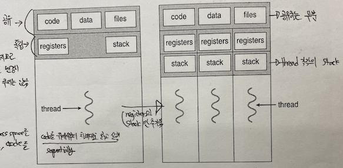
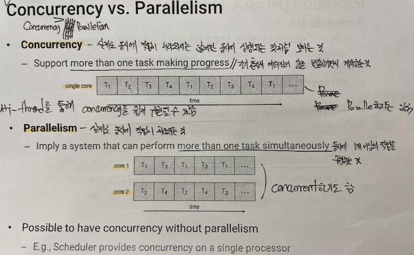

i# Operating System (운영체제)
> ##### Since 2021.06.07

📍 목차

* [운영체제란?](#one)  
* [프로세스](#two)
* [스레드](#three)
* [스케쥴링](#four)

--- 

<h1 id="one">1. 운영체제란</h1>

* [운영체제 정의](#one-one)  
* [운영체제 역할](#one-two)
* [운영체제 종류](#one-three)
* [운영체제 구조](#one-four)

<h2 id="one-one"> 운영체제 정의 </h2>

학부 시절 아주대학교 **김상훈 교수님**께서 운영체제를 영화 <**매트릭스**>에 나오는 '오퍼레이터'에 비유해서 설명해주신 기억이 있다. 매트릭스에 접속한 사람들을 뒤에서 관리해주는 역할인데 영화를 한번 보는 것을 추천한다.  
위의 얘기를 통해 운영체제에 대한 정의는 정말 다양하게 존재한다는 것을 말하고 싶었다.    
* 컴퓨터 하드웨어를 관리하는 프로그램
* 컴퓨터에서 항상 수행되는 프로그램 또는 커널 
* 컴퓨터 하드웨어와 컴퓨터 사용자 간의 인터페이스  
* 컴퓨터 시스템을 편리하게 사용할 수 있도록 해주는 소프트웨어
* 컴퓨터 하드웨어를 효율적으로 이용하게 해주는 소프트웨어
* 다양한 응용 프로그램과 사용자들 사이에서 하드웨어의 사용을 제어 및 조정하는 소프트웨어

위의 정의들을 종합해보면 결국 운영체제는 컴퓨터 시스템의 자원들을 효율적으로 관리하며, 사용자가 컴퓨터를 편리하고 효과적으로 사용할 수 있도록 환경을 제공하는 소프트웨어라고 할 수 있다. 

  
<h2 id="one-two"> 운영체제 역할 </h2>

1. 시스템 관점
* 자원을 적절하게 나눠주고 관리하는 자원 할당자로서의 역할
* 컴퓨터의 부적절한 사용과 오류를 막기 위한 프로그램 제어자로서의 역할
2. 사용자 관점
* 내가 사용하기 쉽고, 편의성을 제공(자원의 효율적인 관리따윈 생각 x)
* 실행중인 프로그램들에 대한 적절한 환경을 제공

> 사용자와 컴퓨터 하드웨어 사이에서 여러 다양한 편리 기능을 제공해주는 소프트웨어  

<h2 id="one-three"> 운영체제 종류 </h2>

대표적인 컴퓨터 운영체제로 Windows, Mac OS, Unix, Linux 등이 있으며, 각 운영체제는 다음과 같은 특징을 가진다.

### 1. Unix
* AT&T 벨 연구소에서 개발한 시불한 시스템 운영체제(1970년대)
* 소스가 개방된 오픈소스 운영체제
* 멀티유저, 멀티태스킹(시분할)
* 트리구조의 파일시스템
* 대부분 C로 작성되어 있어, 이식성이 높고 프로레스간 호환성 높음  
* 커널과 쉘로 구성

### 2. Linux
* 리누즈 토발즈가 Unix 운영체제를 토대로 만든 운영체제(1990년대)
* 유닉스와 완벽한 호환성 유지(POSIX 규격을 따름), Unix 특징과 거의 동일
* 오픈소스 운영체제
* 다양한 배포판(RedHat, Ubuntu, Debian etc..) 존재

### 3. Windows
* Microsoft사에서 개발한 운영체제
* 우수한 GUI 제공
* 선점형 멀티태스킹
* PnP(Plug & Play) 지원
* OLE(Object Linking and Embedding) 지원
* 다양한 파일시스템 지원

### 4. Mac OS
* APPLE 사에서 자사의 매킨토시 컴퓨터에 탑재하기 위해 개발한 운영체제
* 자사의 제품들과의 호환성이 좋음
* 유닉스 기반의 운영체제
* 이쁘다
* 이쁘다..
* 이쁘다...

> 예전에는 유닉스 기반의 OS는 CLI, 윈도우즈는 GUI라는 고정관념(?)이 있었다면, 요즘에는 여러 리눅스 계열 OS에서도 윈도우즈 못지않은 GUI를 제공해주고 있다.

<h2 id="one-four"> 운영체제 구조 </h2>

### 1. Simple Structure
* 최소한의 공간만을 이용하여 만든 단순한 구조의 운영체제
* 사용자/커널 모드 구분이 없음
* 어플리케이션에서 하드웨어로 직접 접근이 가능하여 보안에 취약
* Single Tasking
> MS-DOS가 단순 구조 운영체제에 속한다.

### 2. Layered Approach Structure
* 하드웨어 레이어부터 사용자 레이어까지 계층적으로 구성
* 한 레이어에서의 수정 및 삭제 등의 업데이트 사항이 다른 계층에 영향을 주지 않음
* 각 계층은 인접한 계층으로만 상호작용 가능
> 초기의 UNIX가 계층 구조 운영체제에 속한다.

### 3. Monolithic
* 운영체제가 커널 그 자체
* 시스템 호출 인터페이스와 하드웨어 사이에 모든 것이 존재하는 구조
* 한 계층에서 수많은 기능 제공
* 한 계층에 몰빵되있기 때문에 유지보수가 어려운 단점 존재

### 4. Microkernel
* 중요한 매커니즘만 커널단에 남겨두고, 나머지는 사용자단에서 처리
* 어플리케이션 간의 통신은 커널의 매시지 패싱 방법을 이용
* 확장이 용이
* Monolithic 구조보다 안정적이고 효율적
* 어플리케이션간의 통신에 커널이 개입하므로 약간의 성능저하 이슈는 존재
> The Mach, L3/L4 등이 마이크로커널 구조 운영체제에 속한다.

### 5. Modules
* 핵심 서비스는 커널에서 제공하고, 다른 서비스들은 커널이 실행되는 동안 동적으로 구현
* 마이크로커널 구조와 비슷하지만, 어플리케이션 간 통신에 커널의 개입이 없음
> 현대 운영체제들이 채택한 구조이다.

---

<h1 id="two">2. 프로세스</h1>

* [프로세스 정의](#two-one)  
* [메모리 상의 프로세스](#two-two)
* [프로세스 상태](#two-three)
* [PCB](#two-four)
* [Zombie & Orphan](#two-five)
* [IPC](#two-six)

<h2 id="two-one">프로세스의 정의</h2>

프로세스: 실행 중인 프로그램을 의미하며, 능동적인 존재이다.  
프로그램: 디스크에 저장된 실행파일로, 사용자에 의해 실행되어 메모리에 적재되어야 비로소 프로세스가 되는 수동적인 존재이다.  

> 바탕화면에 깔린 크롬 어플 => 프로그램  / 크롬 어플 더블클릭해서 실행 => 프로세스

<h2 id="two-two">메모리 상의 프로세스</h2>

* Stack 영역: 함수의 매개변수, 지역변수, 리턴값 등 일시적인 자료들을 저장하는 영역이다.  
* Heap 영역: 동적 메모리가 할당되는 영역으로, 프로그래머가 관리하는 영역이다.    
* Data 영역: 전역 변수, static 변수 등이 저장되는 공간이다.  
* Text 영역: 프로그램의 코드가 저장되는 공간이다.  

  

<h2 id="two-three">프로세스 상태</h2>

* New: 프로세스가 생성 중인 상태이다.  
* Running: 명령어들이 실행되고 있는 상태이다.
* Waiting: 프로세스가 특정 사건(이벤트, 인터럽트 등)이 일어나기를 기다리는 상태이다.  
* Ready: 프로세스가 처리기에 할당되기를 기다리는 상태이다.  
* Terminated: 프로세스의 실행이 종료된 상태이다.    

  

> 인터럽트와 이벤트에 의해 프로세스의 상태가 어떻게 변하는지 보시면 좋을 것 같습니다.

<h2 id="two-four">프로세스 제어 블록(Process Control Block; PCB)</h2>

각 프로세스는 운영체제에서 PCB에 의해 표현되는데, PCB란 각각의 프로세스에 대한 여러 정보들을 담고 있는 운영체제의 자료구조이다. Context switching시에 어떤 프로세스를 멈추고 어떤 프로세스에 다시 자원을 할당할지 PCB를 참조한다.
> PCB 구조  
> * 프로세스 상태: 해당 프로세스의 상태  
> * 프로그램 카운터: 해당 프로세스가 다음에 실행할 명령어의 주소  
> * CPU 레지스터들: Accumlator, Index/Stack/General-purpose Register, 상태 코드 등
> * CPU 스케쥴링 정보: 프로세스의 우선순위, 스케줄 큐에 대한 포인터, 다른 스케쥴 매개변수 등  
> * 메모리 관리 정보: Page table, Segment table 등  
> * Accounting 정보: CPU 사용 시간, 경과시간, 시간 제한, 계정 번호, 프로세스 번호 등  
> * 입출력 상태 정보: 해당 프로세스에 할당된 입출력 장치들과 열린 파일 목록 등  

<h2 id="two-five">좀비 프로세스 & 고아 프로세스</h2>

좀비 프로세스: 자식 프로세스가 죽었는데 부모 프로세스가 장례를 치르지 않은 상태의 자식 프로세스(부모가 wait로 죽은 자식 프로세스를 받환받지 않은 상태)  

> wait()는 부모 프로세스가 자식 프로세스의 종료 상태를 반환하기 위해 사용하는 시스템 호출 중 하나  

고아 프로세스: 부모가 wait로 자식 프로세스를 반환시키지 않고 죽어버린 상태의 자식 프로세스
> 고아 프로세스 발생 시, Cascading termination 또는 Reparenting 방식으로 고아 프로세스 문제를 해결
>> Cascading termination: 부모가 죽으면 모든 자식 프로세스들도 종료  
>> Reparenting: 부모가 죽으면 부모를 잃은 자식들을 다른 부모 프로세스로 입양시키는 방식  

<h2 id="two-six">IPC(Inter Process Communications)</h2>

### 1. **공유 메모리(Shared Memory)**  
프로세스간 공유 메모리를 사용하여 통신하는 방식으로, 운영체제는 프로세스의 생성/조인만 관여하고 프로세스 간에 통신하는 것에는 관여하지 않는다는 특징이 있다.
> 장점: 운영체제의 관여가 적어 성능은 좋음  
> 단점: 메모리를 공유하기 때문에, 프로세스간 동기화 문제를 고려해야하므로 설계하기 어려움  

### 2. **메시지 패싱(Message Passing)**  
운영체제가 프로세스 간의 메시지를 교환하는 방식으로 운영체제의 직접적인 관여가 이루어진다. 
> 장점: 분산 환경에서는 메시지 패싱 방법이 효율적  
> 단점: 메시지의 크기가 모두 고정되거나 모두 가변적이어야 한다는 제한사항이 있음  

### 3. **시그널(Signal)**  
프로세스간의 시그널을 보내 통신하는 방식으로, 시그널 핸들러에 의해 각 시그널마다 어떤 행위를 해야하는지 지정할 수 있다.  
각 시그널에 대한 정보는 `man 7 signal` 명령어 입력을 통해 확인할 수 있다.
> 장점: 동기/비동기적으로 모두 동작할 수 있음  

### 4. **원격 함수 호출(Remote Procedure Calls; RPC)**
메시지 패싱 구조 방식 중 하나로, 네트워크로 연결된 클라이언트와 서버 프로세스 간에 stub을 이용해 메시지를 포장하고 푸는 식으로 통신하는 방법이다. 

### 5. **파이프(Pipe)**
초기 Unix 시스템에서 가장 처음에 만들어진 IPC 매커니즘 중 하나로, 파이프라는 가상의 통로를 이용해 프로세스간에 통신하는 방법이다.  
초기에는 동기적으로 한쪽에서 읽기 또는 쓰기만 할 수 있는 일방향성의 파이프(Oridnary Pipe)였지만, 지금은 비동기적으로 양방향 통신이 가능한 Named Pipe로 개선되었다.  

--- 
<h1 id="three">3. 쓰레드</h1>

* [쓰레드 정의](#three-one)  
* [쓰레드 특징](#three-two)
* [병행 vs 병렬](#three-three)
* 
* 
* 

<h2 id ="three-one">쓰레드 정의</h2> 

쓰레드: CPU 이용 또는 프로세스 실행의 기본 단위로, 프로세스의 동적인 부분

<h2 id ="three-two">쓰레드 특징</h2> 
  

* 한 프로세스 내의 쓰레드들은 코드, 전역 변수, 힙 영역, 열린 파일들을 공유한다.
* 각 쓰레드들은 고유의 프로그램 카운터, 스택 포인터, 스택 영역, 쓰레드 아이디를 갖는다.
* 한 개의 쓰레드는 하나의 프로세스에 국한된다.
* 하나의 프로세스는 여러개의 쓰레드를 가질 수 있다.
* 쓰레드는 스케쥴링의 단위가 된다.

<h2 id = "three-three">Concurrency vs Parallelism</h2> 
  

### Concurrency
> 싱글 코어 환경에서 한 시점에 하나의 task만 실행되지만, 매우 짧은 시간에 여러 개의 task들을 번갈아가면서 실행시킴으로써 동시에 실행되는 것처러 보이게 하는 것

### Parallelism
> 멀티 코어 환경에서 한 시점에 실제로 여러개의 task가 동시에 실행되는 것

--- 
<h1 id="four">4. 스케쥴링</h1>

* [프로세스 정의](#two-one)  
* [메모리 상의 프로세스](#two-two)
* [프로세스 상태](#two-three)
* [PCB](#two-four)
* [Zombie & Orphan](#two-five)
* [IPC](#two-six)

하나의 프로세서(cpu)에서는 한 시점에 하나의 프로세스를 실행시킬 수 있는데, 비효율적으로 cpu 자원을 낭비하는 프로세스들이 존재하기에, cpu를 효율적으로 사용하기 위해 여러 프로세스를 한 프로세서에서 실행시키고자 등장한 방법이 바로 스케쥴링이다.

> 기존에 n개의 프로세서에서 n개의 프로세스를 동작시키는 비효율적인 상태에서, n개의 프로세서에서 n개 이상의 프로세스를 실행시킴으로써 더 효율적으로 자원을 사용할 수 있게됨

